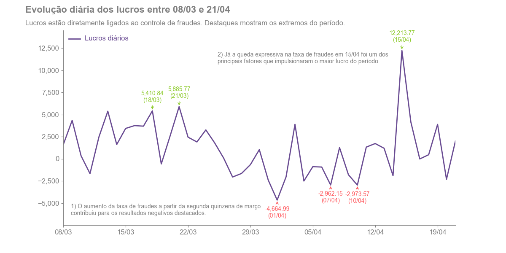
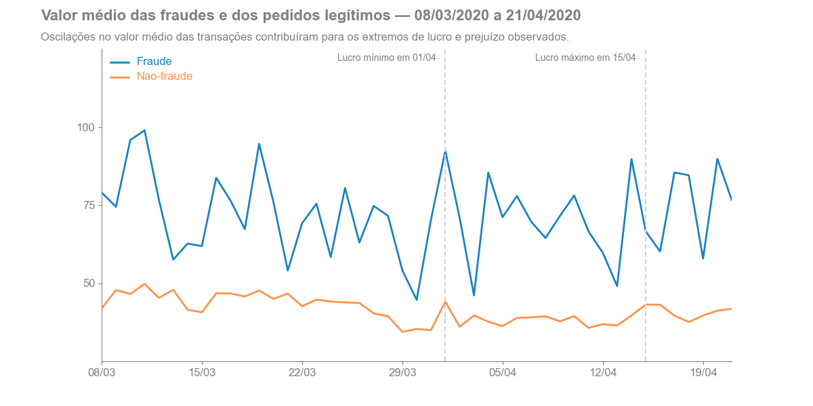
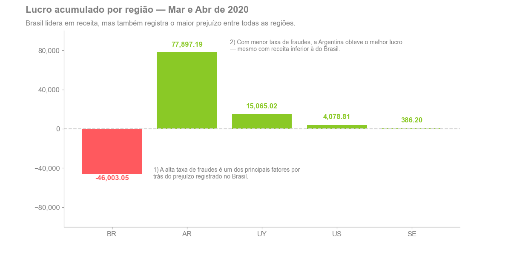
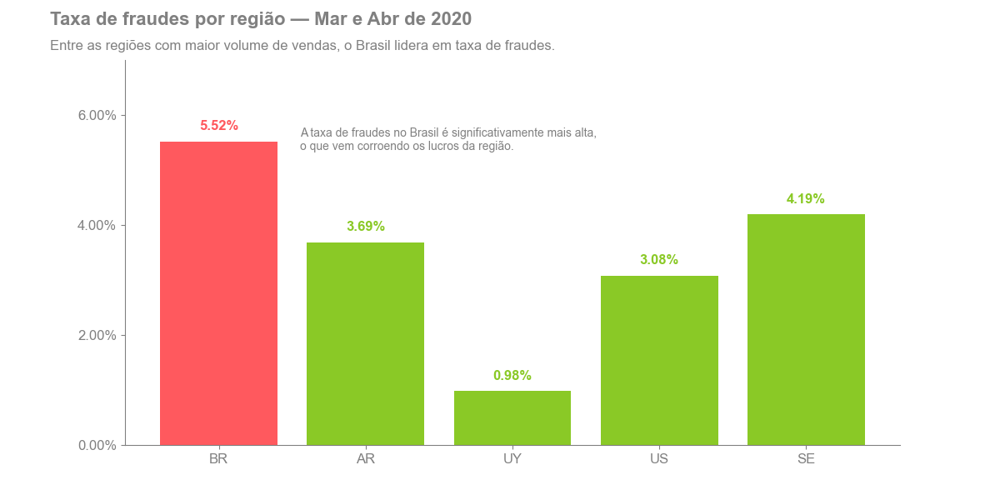

## Fraude em Transações: Uma Análise Exploratória com Apoio Estatístico

### 📑 Índice
- [Visão geral](#item-one)
- [Fonte dos dados](#item-two)
- [Procedimentos de análise de dados](#item-three)
- [Ferramentas utilizadas](#item-four)
- [Principais resultados](#item-five)
- [Conclusões e recomendações](#item-six)

---

<!-- headings -->
<a id='item-one'></a>
### 🟩 Visão geral

A **prevenção e detecção de fraudes** é uma atividade essencial para empresas dos mais diversos setores. Transações fraudulentas, quando não controladas, podem gerar **perdas financeiras significativas** e comprometer os resultados do negócio. Por isso, as fraudes são uma preocupação constante das organizações, que buscam aprimorar continuamente seus processos de prevenção — desde **políticas de governança e segurança** até a adoção de **ferramentas analíticas e aplicações automatizadas**.

Neste contexto, o objetivo geral deste projeto é **identificar e analisar os principais fatores associados à ocorrência de transações fraudulentas**.

A partir de uma abordagem estatística, buscou-se construir um **perfil característico das fraudes**. Os procedimentos adotados envolveram **análises exploratórias, uso de estatísticas descritivas e realização de testes de hipóteses**.

[Veja o projeto completo aqui](https://github.com/manoel-nto/Case_Fraude/blob/main/notebooks/analise-fraude.ipynb).

---

<!-- headings -->
<a id='item-three'></a>
### 🔍 Procedimentos de análise de dados

Os procedimentos adotados na análise dos dados envolveram, fundamentalmente, o uso de **visualizações**, **estatísticas descritivas** e **testes de hipóteses**.

Inicialmente, foram analisados **KPIs relacionados a fraudes**, com foco em seu comportamento ao longo do tempo. Em seguida, realizou-se a **análise exploratória dos dados** (*EDA*), com o objetivo de examinar e caracterizar o conjunto de dados disponíveis. Por fim, conduziram-se **testes de hipóteses** para avaliar a consistência das suposições formuladas no início do projeto.

Em conjunto, esses procedimentos permitiram uma **análise aprofundada** e embasada, contribuindo para a **construção de um perfil característico das transações fraudulentas**.

---

<!-- headings -->
<a id='item-four'></a>
### 🛠️ Ferramentas utilizadas

-  Visual Studio Code
-  Python
-  Matplotlib
-  Pandas
-  Scipy
-  Statsmodels

---

<!-- headings -->
<a id='item-five'></a>
### 📊 Principais resultados

Os lucros estão diretamente ligados ao controle de fraudes. Aumentos ou quedas substanciais nas taxas de fraude ao longo do período analisado estão associados, respectivamente, a quedas ou aumentos nos lucros:



De forma semelhante, oscilações no valor médio das transações — fraudulentas ou legítimas — influenciaram diretamente os resultados financeiros, afetando lucros e prejuízos:



O Brasil (BR) concentra 74% dos pedidos. No entanto, o resultado acumulado do país é negativo, devido à alta taxa de fraudes e ao maior valor médio das transações fraudulentas, em comparação com outros países:

 



Transações com valores elevados parecem ter maior probabilidade de serem fraudulentas:

```python
# Frequencias absolutas de fraudes por valor - "Alto" ou "Baixo"
count = data.loc["Fraude"].values  

# Total de pedidos por valor
nobs = data.sum(axis=0).values  

# Teste de proporções para verificar se a taxa de fraudes é maior em pedidos de valor alto
ts.proporcoes_norm(
    count, nobs, 0.05, "larger"
) 
```

```output
z-score: 18.166656687587796
p-value: 4.7400868018884794e-74
Rejeitar a hipótese nula
```

---

<!-- headings -->
<a id='item-six'></a>
### 📝 Conclusões e recomendações

Neste projeto, buscou-se identificar e analisar os *principais fatores associados à ocorrência de transações fraudulentas*, com o objetivo de traçar um *perfil característico dessas fraudes*. A análise trouxe evidências que corroboram ideias amplamente aceitas na gestão de fraudes, como:

* Taxas elevadas de fraude podem impactar significativamente os resultados financeiros, reduzindo as margens de lucro;
* O valor da transação pode estar associado à probabilidade de ocorrência de fraude;
* Perfis incompletos — com dados ausentes ou documentos não entregues — podem estar relacionados a transações fraudulentas.

Identificar fatores associados à fraude representa um desafio técnico e operacional para as empresas. No entanto, quando realizado com rigor, esse processo pode contribuir para o aprimoramento dos mecanismos de prevenção e detecção de fraudes, reduzindo perdas financeiras.

Vale destacar que as hipóteses iniciais também poderiam ser investigadas por meio de modelos de classificação, como a **regressão logística**, com base na análise dos coeficientes estimados. Futuras versões deste projeto podem adotar essa abordagem para aprofundar a análise e testar a robustez dos achados exploratórios.

---
